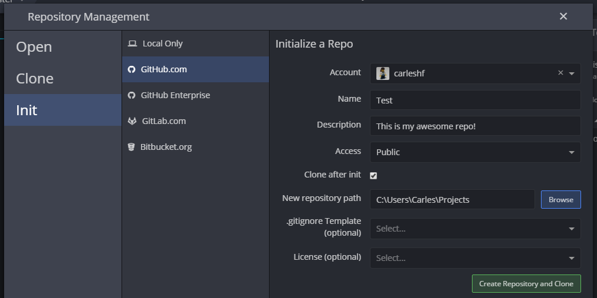
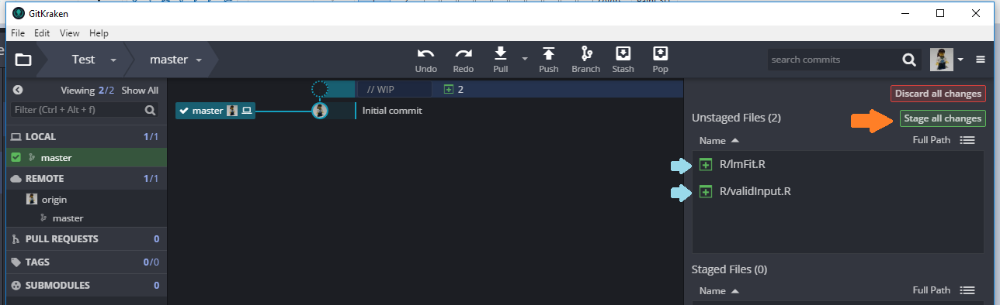
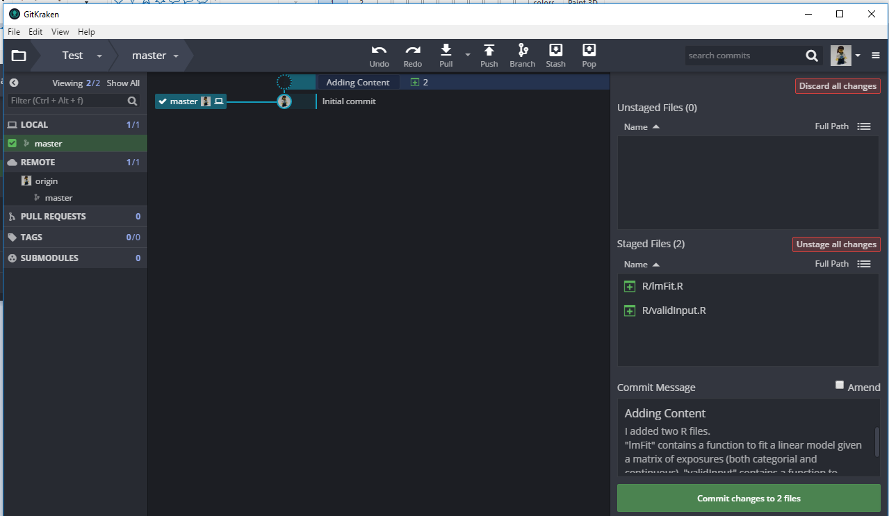
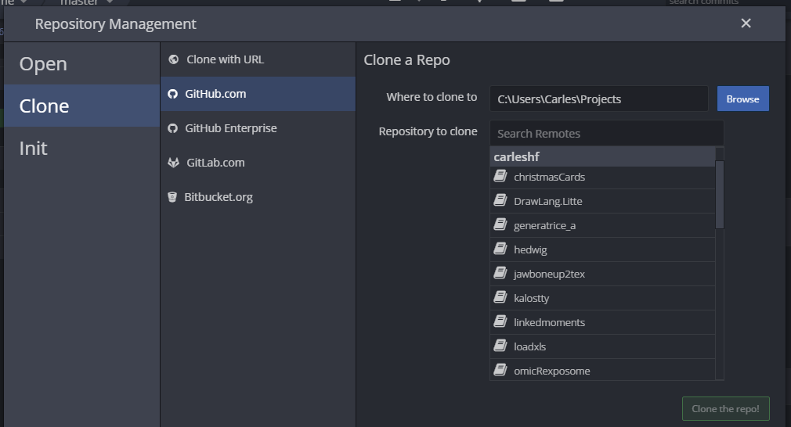

```{r setup, include=FALSE}
knitr::opts_chunk$set(echo = FALSE)
```

What is a Version Control System?
========================================================

 - **Version Control System** (VCS) is a system that records changes to a file or set of files over time so that you can recall specific versions later.

 - Using a **VCS** also generally means that if you screw things up or lose files, you can easily recover. In addition, you get all this for very little overhead.
 
 - **VCS** are sometimes known as *Source Code Management* (SCM) tools or *Revision Control System* (RCS).


Benefits of Version Control System
========================================================
1) **A complete long-term change history of every file**

This means every change made by many individuals over the years is tracked and stored. Changes include:

 - Creation of files
 - Deletion of files 
 - Edits to files contents

Having the complete history of changes enables going back to previous versions to help locate the cause of current problems and it is crucial when needing to fix problems in older versions of software.


Benefits of Version Control System
========================================================
2) **Branching and merging**

Creating a *branch* in VCS tools keeps multiple streams of work independent from each other while also providing the facility to *merge* that work back together, enabling developers to verify that the changes on each branch do not conflict. 


Benefits of Version Control System
========================================================
3) **Traceability**

Being able to trace each change made and being able to annotate each change with a message describing the purpose and intent of the change can help with root cause analysis and other forensics. 

Having the annotated history of the code at your fingertips when you are reading the code, trying to understand what it is doing and why it is so designed can enable developers to make correct and harmonious changes that are in accord with the intended long-term design of the system.


What is Git?
========================================================
While it is possible to develop software without using any version control, doing so subjects the project to a huge risk that no professional team would be advised to accept. 
So the question is not whether to use version control but which version control system to use.

There are many choices, but one of the most popular VCS tools in use today is called **Git**. Like many of the most popular VCS systems available today, Git is free and open source.

 - Git: [https://git-scm.com/](https://git-scm.com/)


What is Git?
========================================================
Git is a mature, actively maintained open source project originally developed in 2005 by *Linus Torvalds*, the famous creator of the Linux operating system kernel. 

**Git** is an example of a Distributed Version Control System (DVCS) because it has a distributed architecture. Rather than have only one single place for the full version history of the software as is common in *old* version control systems like CVS or Subversion, in Git, every developer's working copy of the code is also a repository that can contain the **full history of all changes**.


What is Git?
========================================================
One common criticism of Git is that it can be difficult to learn. Some of the terminology in Git will be novel to newcomers and for users of other systems, the Git terminology may be different


What is GitHub?
========================================================
**GitHub** is a code hosting platform for version control and collaboration. It is a social network that has completely changed the way we work and we code.

Having started as a developer's collaborative platform, **GitHub** is now the largest online storage space of collaborative works that exists in the world. 

 - GitHub: [https://github.com/](https://github.com/)


What is GitHub?
========================================================
Alternatives to **GitHub** are:

  - Bitbucket - *free* - [https://bitbucket.org/](https://bitbucket.org/)
  - SourceForge - *free* - [https://sourceforge.net/](https://sourceforge.net/)
  - GitLab - *free* - [https://about.gitlab.com/](https://about.gitlab.com/)
  - CodePlex - *free* - [http://www.codeplex.com/](http://www.codeplex.com/)
  - Kiln  - *paid* - [http://www.fogcreek.com/fogbugz/devhub](http://www.fogcreek.com/fogbugz/devhub)
  - Codeplane - *paid* - [https://codeplane.com/](https://codeplane.com/)


What is GitKraken?
========================================================
Let me quote from their website:

> Axosoft GitKraken is a cross-platform Git client with efficiency, elegance and reliability at the core. It was made for devs by devs.

**GitKraken** is a client for working with the *Version Control System* Git. It is cross-platform, efficient, elegant and reliable.

Why we need to use a client for working with Git? We do not need it, we can always use Git through terminal application but a client with a graphical user interface will help understand what is happening in the projects.

Exercise 1
========================================================
 1. If you do not have **Git** installed, download and install it
    - Git: [https://git-scm.com/](https://git-scm.com/)
 2. Go to **GitHub** and create an account
    - GitHub: [https://github.com/](https://github.com/)
 3. If you do not have **GitKraken** installed, download and install it
    - GitKraken: [https://www.gitkraken.com/](https://www.gitkraken.com/)


First steps with Git and GitHub
========================================================
There are a lot of different ways to use **Git**:

  1. There are the original command line tools.
  2. There are many graphical user interfaces of varying capabilities. 

We will take a glance on the *command line tools* and then we will move to *GitKraken* client.

Unfortunately, most of the GUIs (like *GitKraken*) only implement some subset of Git functionality for simplicity. While your choice of graphical client is a matter of personal taste, all users will have the command-line tools installed and available.


First steps with Git and GitHub
========================================================
**Git Command Line**: Configuration

the first command we will learn is ``config``, from *configuration*. This command is mostly used during the first-time git setup, also when creating projects.

  - Configuration of *Your Identity*

The first thing you should do when you install Git is to set your user name and email address. This is important because every Git commit uses this information, and it's immutably baked into the commits you start creating:

```
$ git config --global user.name "John Doe"
$ git config --global user.email johndoe@example.com
```


First steps with Git and GitHub
========================================================
**Git Command Line**: Configuration

  - Checking Your Settings

If you want to check your settings, you can use the git ``config --list`` command to list all the settings Git can find at that point:

```
$ git config --list
user.name=John Doe
user.email=johndoe@example.com
color.status=auto
color.branch=auto
color.interactive=auto
color.diff=auto
...
```


First steps with Git and GitHub
========================================================
**Creating a Project**

First we use the *command line prompt* to move to the folder where the projects is located.

  - For *Linux*:

```
$ cd /home/user/your_project
```

  - For *Mac*:

```
$ cd /Users/user/your_project
```

  - For *Windows*:

```
$ cd /c/User/your_project
```


First steps with Git and GitHub
========================================================
**Creating a Project**

Then we type:

```
$ git init
```

This creates a new sub-directory named ``.git`` that contains all of our necessary repository files. At this point, nothing in our project is tracked yet.


First steps with Git and GitHub
========================================================
**Addint content to a Project**

 - Checking the Status of Your Files

The main tool we use to determine which files are in which state is the ``git status`` command. If we run this command directly after creating the project we should see something like this:

```
$ git status
On branch master
Initial commit
nothing to commit (create/copy files and use [...]
```

This means we have a clean working directory. The command tells us which branch we are on and informs that it has not diverged from the same branch on the server. For now, that branch is always **"master"**, which is the default.


First steps with Git and GitHub
========================================================
**Addint content to a Project**

Let's say we want to add a new file, the simple ``README`` file. If the file did not exist before, and we run ``git status``, we see the untracked file:

```
$ echo '#My Project' > README
$ git status
On branch master
Initial commit
Untracked files:
  (use "git add <file>..." to include in what will [...]
        README
nothing added to commit but untracked files present [...]
```

First steps with Git and GitHub
========================================================
**Addint content to a Project**

In order to begin tracking a new file, we use the command ``git add``. To begin tracking the ``README`` file:

```
$ git add README
```

If we run your status command again, we can see that your README file is now tracked:

```
$ git status
On branch master
Initial commit
Changes to be committed:
  (use "git reset HEAD <file>..." to unstage)
    new file:   README
```

First steps with Git and GitHub
========================================================
**Committing changes on a Project**

They will stay as modified files on your disk. In this case, let's say that the last time you ran git status, you saw that everything was staged, so you're ready to commit your changes. The simplest way to commit is to type git commit:

```
$ git commit
```

Doing so launches an editor to write the title and the content of the *commit*. The editor can be set by your shell's $EDITOR environment variable (usually vim or emacs), although we can configure it with whatever you want using the ``git config --global core.editor`` command.


First steps with Git and GitHub
========================================================
**Committing changes on a Project**
The editor displays the following text (this example is a Vim screen):

```
# Please enter the commit message for your changes. 
# Lines starting with '#' will be ignored, and an empty 
# message aborts the commit.
# On branch master
#
# Initial commit
#
# Changes to be committed:
#	new file:   README
#
~
".git/COMMIT_EDITMSG" 9L, 283C
```

First steps with Git and GitHub
========================================================
**Committing changes on a Project**

Once filled the title and content of the *commit*, the *command line promp* will show the information about the *commit*:

```
$ git commit
[master (root-commit) 6ad489f] This is a test
 1 file changed, 1 insertion(+)
 create mode 100644 README
```

Once done the commit, if we re-run the ``git status`` we already have a clean project:

```
$ git status
On branch master
nothing to commit, working tree clean
```


First steps with Git and GitHub
========================================================
**Pushing a Project to a repository**

To **push** the changes to a repository we should add the URL for the remote repository.

```
git remote add origin remote_repository_URL
```

Then we push the changes in out local repository to the remote repository.

```
git push origin master
```


Exercise 2
========================================================
**Part 1**: Go to your account at *GitHub* and create a project called ``test``.


Exercise 2
========================================================
**Part 2**: 

 1. Using the *command line*, go to your ``home`` and create a folder named ``project_test``. 
 2. Initiate a Git repository there. 
 3. Add a file called ``README`` having your name in it.
 4. Save all the local changes. Add the URL of your GitHub repository and push the changes.


Using GitKraken with GitHub
========================================================


Using GitKraken with GitHub
========================================================
**Create a new Repository**




Using GitKraken with GitHub
========================================================
**Adding content to Repository**




Using GitKraken with GitHub
========================================================
**Adding content to Repository**




Using GitKraken with GitHub
========================================================
**Pushing a Project to a repository**


Exercise 3
========================================================
Delete the folder ``test`` from our home. Use **GitKraken** to **clone** the repository from you GitHub account.




Git Branches
========================================================
A **branch** represents an independent line of development.

You can think of them as a way to request a brand new working directory and project history. New commits are recorded in the history for the **current branch**, which results in a **fork** in the *history of the project*.

The ``git branch`` command allows:

 - To create breanches
 - To list current existing branches.
 - To rename existing branches
 - Tp delete branches. 

But it doesn't let you *switch between branches* or put a *forked history back together* again. These are de domains of integrated with the ``git checkout`` and ``git merge`` commands.


Git Branches in GitHub
========================================================

GitHub defines **branching** as the way to work on different versions of a repository at one time.

By default your repository has one branch named **master** which is considered to be the definitive branch.

When you create a **branch** off the **master branch**, you are making a copy of **master** as it was at that point in time.


Git Branches with GitKraken
========================================================
