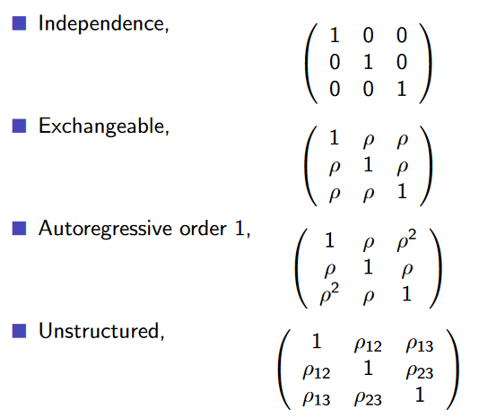
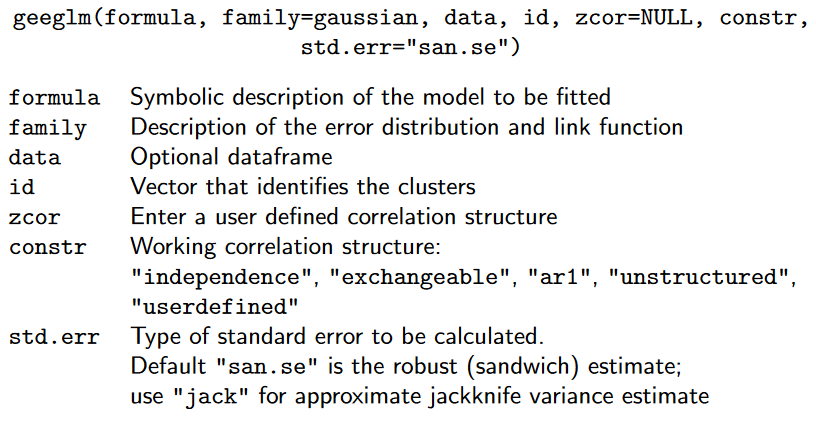
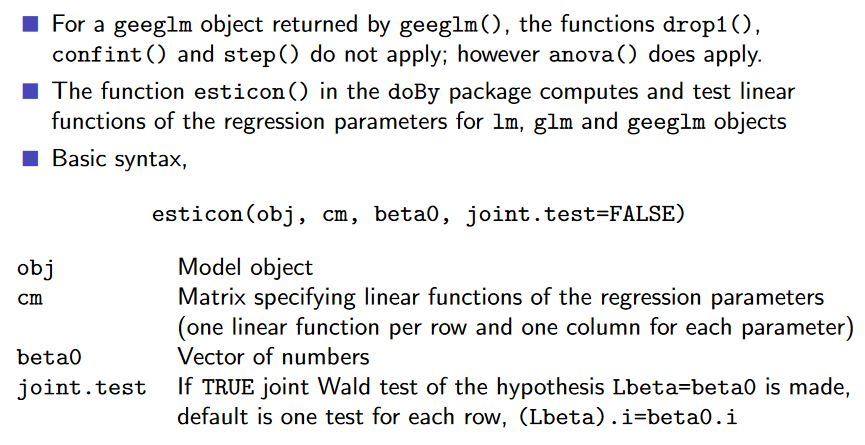
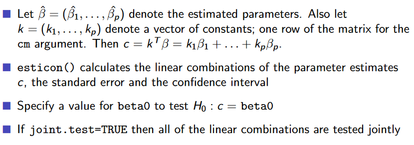
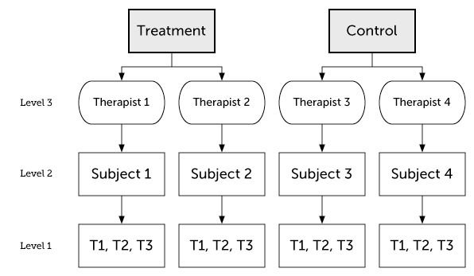

```{r setup, include=FALSE}
knitr::opts_chunk$set(echo = TRUE, comment="", message=FALSE, 
                      warning=FALSE, cache=TRUE, fig.width = 4, 
                      fig.height = 4)
```

# Modelos modernos para datos longitudinales

- Datos longitudinales recogen observaciones repetidas de la variable respuest a lo largo del tiempo, en un mismo individuo
- El análisis correcto de estos datos contempla que la correlación entre las medidas de cada sujeto es tenida en cuenta
- A parte de las aproximaciones tradicionales (vistas en la clase anterior), también se puede:
     - Utilizar *Ecuaciones de Estimación Generalizadas*: GEE
     - Modelos lineales mixtos
  

# Modelos GEE

- Modelan la esperanza marginal o poblacional incorporando la correlación entre las observaciones correspondientes a un mismo individuo, y se asume independencia de los individuos
- Admiten que la variable respuesta siga una distribución distinta a la Gausiana
- Consideran una ecuación de estimación que se escribe en dos partes: una para modelar los parametros de regresión y la segunda para modelar la correlación
- Son bastante flexibles ya que el modelo sólo necesita explicitar una función "link", una función de varianza y una estructura de correlación

# Modelos GEE

- Funcionan bien cuando:
    - el número de observaciones por sujeto es pequeño y el número de sujetos es grande
    - se tratan estudios longitudinales donde las medidas siempre se toman en el mismo instante de tiempo para todos los sujetos

# Modelos GEE: Formulación

- Parte sistemática [lo mismo que un GLM]
    $$ g(E(Y_{ij})) = g(\mu_{ij}) = \beta' X_{ij} $$
donde $i=1, \ldots, n$ y $j=1, \ldots, n_i$, y $n$ denota el número de individuos, y $n_i$ el número de medidas repetidas para el individuo $i$-ésimo

- Parte aleatoria
    $$ V(Y_{ij})=\nu(\mu_{ij}) \phi $$
donde $\nu$ es la función de la varianza y $\phi$ el parámetro de escala

- Además se tiene que explicitar la estructura de la correlación mediante la *working correlation matrix*, $R(\alpha)$

# Modelos GEE



# Modelos GEE

- No es necesaria la especificación de un modelo estadístico. Es decir, no es necesario conocer $f(y|parámetros)$. Así, son flexibles, pero:
    - la estimación de las $\beta$'s no tiene porqué se la mejor posible
    - la inferencia está basada en resultados asintóticos
    - los métodos de validación son complicados
  
- La estimación de los parámetros se puede encontrar en muchos sitios (ver por ejemplo Liang y Zeger, Biometrika, 1986  o Zeger et al, Biometrics, 1988)
- Si hay datos faltantes (missing) la estimación sólo es correcta si los missing son MCAR (missing completely at Random)


# Modelos GEE: estimación de parámetros

La función `geeglm` from the `geepack` es muy similar a la `glm` 



# Modelos GEE: estimación de parámetros



# `esticon()`




# GEE: estimación de parámetros

**`ohio`** dataset: Health effect of air pollution. Children followed for four years, wheeze status (`resp`: 0-no, 1-yes) recorded annually as well as maternal smoking and age (0 is 9 years old) [**datos en formato largo**]

```{r gee}
library(geepack)
data(ohio)
head(ohio)
```


# GEE: estimación de parámetros

```{r gee2, eval=FALSE}
library(ggplot2)
dd.agg <- aggregate(resp ~ age + smoke, 
                    data=ohio, FUN = mean)
ggplot(dd.agg, aes(y=resp, x=age,
                   fill=as.factor(smoke))) + 
    geom_bar(position="dodge", stat="identity")
```

# GEE: estimación de parámetros


```{r gee3, echo=FALSE}
library(ggplot2)
dd.agg <- aggregate(resp ~ age + smoke, 
                    data=ohio, FUN = mean)
ggplot(dd.agg, aes(y=resp, x=age,
                   fill=as.factor(smoke))) + 
    geom_bar(position="dodge", stat="identity")
```

# GEE: estimación de parámetros

El outcome es binario -> binomial 

```{r gee_fit}
fit.exch <- geeglm(resp~age*smoke, 
                   family=binomial(link="logit"),
                   data=ohio, id=id, 
                   corstr = "exchangeable",
                   std.err="san.se")
fit.unstr <- geeglm(resp~age*smoke, 
                    family=binomial(link="logit"),
                    data=ohio, id=id, 
                    corstr = "unstructured",
                    std.err="san.se")
```

 
# GEE: estimación de parámetros

\tiny

```{r summary3}
summary(fit.exch)
```
\normalsize

# GEE: estimación de parámetros

\tiny

```{r summary2}
summary(fit.unstr)
```
\normalsize


# GEE: estimación de parámetros

Edad como categórica

\tiny
```{r fit_cat}
fit <- geeglm(resp~factor(age)+smoke, family=binomial(link="logit"),
              data=ohio, id=id, corstr = "exchangeable",
              std.err="san.se")
summary(fit)
```
\normalsize


# GEE: estimación de parámetros

Podemos testar el efecto de una covariable usando un test de razón de verosimilitud

```{r anova}
fit1 <- geeglm(resp ~ factor(age) + smoke,
               family=binomial(link="logit"),
               data=ohio, id=id, corstr = "exchangeable",
               std.err="san.se")
fit2 <- geeglm(resp ~ factor(age), family=binomial(link="logit"),
               data=ohio, id=id, corstr = "exchangeable",
               std.err="san.se")
```

# GEE: estimación de parámetros

```{r show_anova}
anova(fit1, fit2)
``` 


# GEE: estimación de parámetros

Podemos hacer un test para un parámetro en particular

\tiny
```{r con_par}
library(doBy)
est <- esticon(fit, diag(5))
est
```
\normalsize


# GEE: estimación de parámetros

ORs e IC95%

```{r or}
OR.CI <- exp(cbind(est$Estimate, est$Lower, est$Upper))
rownames(OR.CI) <- names(coef(fit))
colnames(OR.CI) <- c("OR", "Lower OR", "Upper OR")
OR.CI
```


# GEE: estimación de parámetros

- Podemos preguntarnos ... ¿cuál es el riesgo de 'wheezing' a los 9 años para un niño cuya madre ha fumado?

- Es decir, estima [smoke+factor(age)0] - [factor(age)-1]

```{r estimate}
val <- esticon(fit, c(0,-1,1,0,1))
exp(val$Estimate)
val
```


# Modelos mixtos

- Como vimos en la sesión anterior, se podría usar un modelo lineal, pero:
      - Las observaciones repetidas en cada grupo o cluster, no son necesariamente independientes.
      - Con frecuencia, no solo se quieren tomar decisiones respecto de los grupos o cluster observados, sino que se quiere valorar el efecto de las variables explicativas en una población de la que los grupos son una muestra.
      - Puede ser de interés valorar la variación del efecto de x de un grupo a otro.
      - La estimación del efecto medio de las variables explicativas en cada grupo puede ser
muy deficiente si no se recoge la posible variabilidad entre los grupos.

# Modelos mixtos
- Modeliza la realación entre la variable dependiente y las covariables
- Estima la correlación intra-individuo (se puede especificar una estructura)
- Se pueden aplicar a muchas situaciones (datos multinivel, ANOVA, datos longitudinales)
- No requieren puntos equidistantes (son covariables -se modeliza el efecto)
- Son robustos ante los missing  

# Modelos mixtos

Un modelo mixto se puede representar como:

$$\ y = X \beta + Zu + \epsilon\,\!$$

\bigskip

donde

- [$y$] son las observaciones, con media $E(y)=X\beta$

- [$\beta$] es un vector de efectos fijos

- [$u$] is un vector i.i.d de variables aleatorias con media
 $E(u)=0$ y matriz de varianza-covarianza $\operatorname{var}(u)=G$

- [$\epsilon$] es un vector de términos i.i.d. correspondientes al error aleatorio con media $E(\epsilon)=0$ y varianza $\operatorname{var}(\epsilon)=R$

- [$X$ and $Z$] son matrices de regresores que relacionan las observaciones $y$ con $\beta$ y $u$


# Modelos mixtos

- Modelo sencillo para interpretar (modelo lineal mixto con intercept aleatorio)
  
$$y_{ij} = \beta_0 + \beta_1 X_{ij} + a_{ij} + \epsilon_{ij}$$
$$ a_i ~ N(0, \tau_{a}^2) \mbox{ ,} \tau_{a}^2 \ge 0 $$
$$ \epsilon_{ij} ~ N(0, \tau^2) \mbox{ ,} \tau^2 > 0 $$

- El modelo presenta ahora un intercept aleatorio (centrado en 0) que depende del individuo $i$-ésimo

- La varianza del efecto aleatorio recoge la variabilidad entre los diferentes individuos
- La varianza del error recoge la variabilidad dentro de cada individuo no explicada por el modelo. NOTA: si la varianza del efecto aleatorio fuese nula, el modelo coincidiría con el modelo de efectos fijos o de regresión lineal.


# Modelos mixtos

- librería `nlme` o `lme4`
- **`BodyWeight`**: Rat weight over time for different diets

```{r nlme}
library(nlme)
data("BodyWeight" , package="nlme")
head(BodyWeight)
```

# Modelos mixtos

Debemos especificar la estructura de los datos mediante la función `groupedData`

```{r estructura}
datos.s <-groupedData(weight ~ Time | Rat, BodyWeight)
head(datos.s)
```

# Modelos mixtos

Usa la librería `trellis` para graficar (muy potente)

```{r grafica}
plot(datos.s)
```

# Modelos mixtos

```{r grafica2}
plot(datos.s, outer="Diet")
```

# Modelos mixtos

```{r grafica3}
plot(datos.s, inner="Diet")
```

# Modelos mixtos

El modelo de intercept aleatorio puede estimarse con:

\tiny
```{r modelo1}
mod.lme <-lme(weight ~ Time * Diet, datos.s, random =  ~ 1)
mod.lme
```
\normalsize

# Modelos mixtos

Y podemos estimar la parte fija y aleatoria con

```{r plotaug}
plot(augPred(mod.lme, level = 0:1, length.out = 2))
```

# Modelos mixtos


```{r modelo1_sum}
summary(mod.lme)
```


# Modelos mixtos

Comparamos con un modelo lineal

\tiny
```{r modelo lineal}
mod.lm <-lm(weight ~ Time * Diet, BodyWeight)
summary(mod.lm)
```
\normalsize

# Modelos mixtos

El modelo con intercept y pendiente aleatoria puede estimarse con:

\tiny
```{r modelo lme2}
mod.lme2 <-lme(weight ~ Time * Diet, random = ~ Time,
               datos.s)
summary(mod.lme2)
```
\normalsize


# Modelos mixtos


```{r plotaug2}
plot(augPred(mod.lme2, level = 0:1, length.out = 2))
```

# Modelos mixtos

¿cuál es necesario?

\tiny
```{r anova2}
anova(mod.lme, mod.lme2)
```
\normalsize

# Modelos mixtos

Model checking

```{r check}
plot(mod.lme)
```


# Modelos anidados

Los **efectos anidados**, el factor aparece SÓLO dentro de un nivel particular de otro factor (cada ojo es de un individuo); para los **efectos cruzados** un factor puede aparecer en más de un nivel de otro factor  




# Modelos anidados


```{r nested, eval=FALSE}
mod.nested <- lme(y ~ time*covar, 
                  random = ~ time | teraphist/subject,
                  data = df)
summary(mod.nested)
```


# Modelos para datos binarios

**`ohio`** dataset: Health effect of air pollution. Children followed for four years, wheeze status (`resp`: 0-no, 1-yes) recorded annually as well as maternal smoking and age (0 is 9 years old) [**datos en formato largo**]

```{r binarios}
library(lme4)
mod.bin <- lmer(resp ~ age*smoke + (1|id), 
                data=ohio, family="binomial" )
summary(mod.bin)
```


# GEE: estimación de parámetros


```{r gee4, echo=FALSE}
library(ggplot2)
dd.agg <- aggregate(resp ~ age + smoke, 
                    data=ohio, FUN = mean)
ggplot(dd.agg, aes(y=resp, x=age,
                   fill=as.factor(smoke))) + 
    geom_bar(position="dodge", stat="identity")
```


# Modelos para datos binarios 

```
Fixed effects:
            Estimate Std. Error z value Pr(>|z|)    
(Intercept) -3.40171    0.27884 -12.200   <2e-16 ***
age         -0.21704    0.08678  -2.501   0.0124 *  
smoke        0.47824    0.29925   1.598   0.1100    
age:smoke    0.10465    0.13912   0.752   0.4519   
```

# Modelos para datos binarios

Estimates with 95% CI

```{r sum_bin}
se <- sqrt(diag(vcov(mod.bin)))
tab <- cbind(Est = fixef(mod.bin),
            Lower = fixef(mod.bin) - 1.96 * se, 
            Upper = fixef(mod.bin) + 1.96 * se)
```


# Modelos para datos binarios

```{r sum_bin_show}
tab
```


# Exercises

1. Analiza de nuevo los datos `agudezavisual.txt` usando un modelo mixto (ojo dentro de individuo) [NOTA: diferente al modelo tradicional que agregaría los datos]. ¿Hay un efecto tiempo?

2. El dataset `Milk` estudia el contenido de proteina en la leche de vaca (variable `protein`). Se dispone de datos desde el parto (variable `Time`) para distintas vacas (variable `Cow`). Estamos interesados en saber qué dieta (variable `Diet`) produce una leche con un mayor contenido de proeínas. Contesta a esta pregunta analizando los datos que puedes cargar con 

`data("Milk", package="nlme")`

3. Investigadores están interesados en saber si la distancia entre dientes (variable `distance`) en niños y niñas (variable `Sex`) que llevan ortodocia evoluciona de la misma manera a lo largo del tiempo (variable `age`). Contesta a esta pregunta científica analizando los datos que puedes cargar en R con:

`data("Orthodont", package="nlme")`
