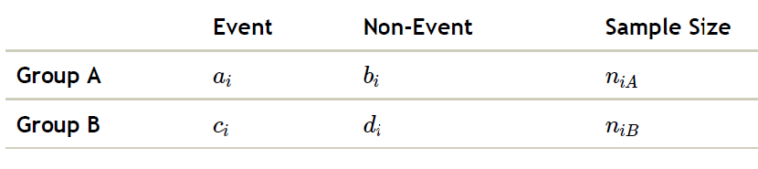
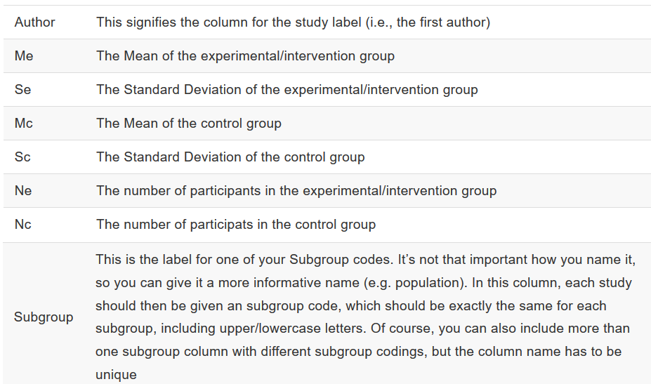
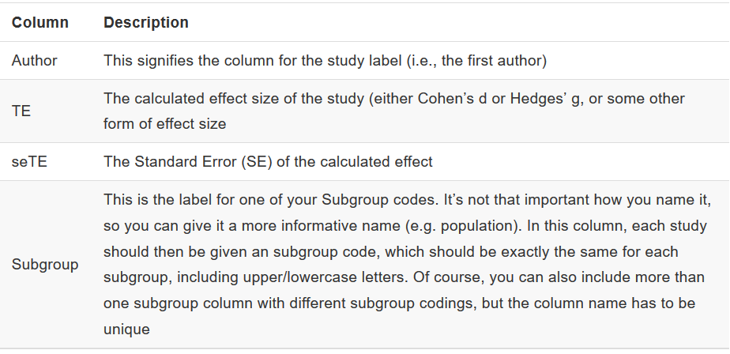
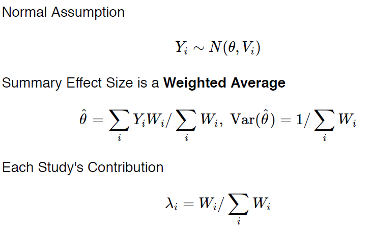
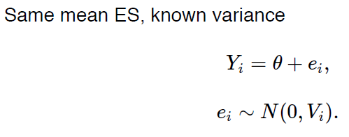
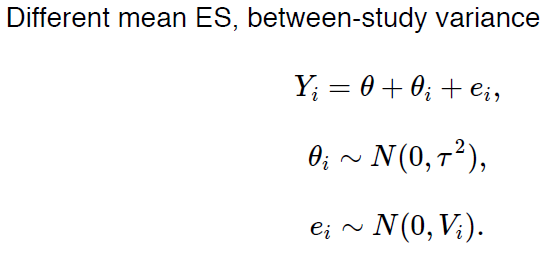
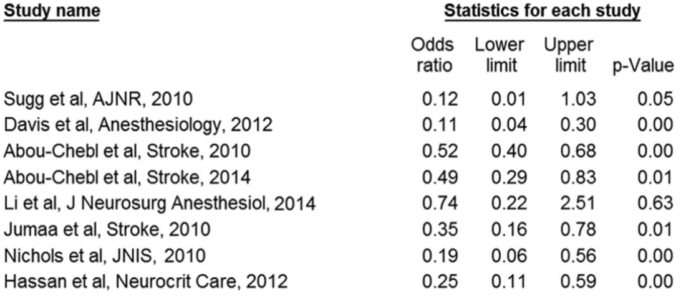

```{r setup, include=FALSE}
knitr::opts_chunk$set(echo = TRUE, comment="", message=FALSE, warning=FALSE, cache=TRUE, fig.width = 4, fig.height = 4)
options(width=80)
```

## Preliminaries

```{r install, eval=FALSE}
install.packages(c("rmeta", "meta", "altmeta",
                   "RISmed", "RCurl"))
```

I assume you are familiar with:

- R
- RStudio
- RMarkdown


## Outline
- Overview
- Types of effects
- Searching The Literature
- Prepare data
- Pooling Effect Sizes
      - Fixed Effects Model
      - Random Effects Model
      - Forest plot
- Evaluating Heterogeneity
      - Funnel plot
      - Sensitivity Analysis
      - Subgroup Analysis
      - Outlier's detection
- Meta-Regression (Mixed Effects Model)
- Publication Bias
      - Trim-and-fill
      - Fail-Safe N
      - P-curve


## What a meta-analysis is?

**Quantitative** approach for **systematically combining** results of **previous research** to achieve **conclusions** about our scientifc question.

- quantitative: numbers
- systematic : methodological
- combining: putting together
- previous research: evidence based
- conclusions: new knowledge

## What a meta-analysis is?

> 'The analysis of analyses'

Gene V. Glass. Primary, secondary and meta-analysis of research.
Educational Researcher, 1976.

## What a meta-analysis is?

- More formally... a meta-analysis is the synthesis of:
    - compatible effects ($Y_i$)
    - (Preferably, but not necessarily, from randomized controlled trials)

- Giving greater weight to studies with:
    - Less variance ($V_i$), and
    - More precision ($W_i = 1/V_i$)
    

## Types of effects

An **effect** could be almost any aggregate statistic of interest:

- Mean, Mean difference, Mean change
- Risk ratio, Odds ratio, Risk difference
- Incidence rate, Prevalence, Proportion
- Correlation, slope

## Estimation of effect size (ES)

- An effect size could be almost any summary statistic (e.g. a
mean, a difference in proportions, an adjusted odds ratio, etc.)
- Conventional meta-analytic models assume normality of ESs.
Because of the CLT, this will holds for most ESs given large
enough samples.
- To normalize ESs, a log-transform is common.

## Estimation of effect size (ES)



- Effect size estimate (log odds ratio):

$LOR=\log(\frac{a \times d}{c \times b})$

- Variance

$V=\frac{1}{a}+\frac{1}{b}+\frac{1}{c}+\frac{1}{d}$


## Motivating example


\begin{figure}
 \includegraphics[width=400pt, height = 200pt]{figures/aspirin.jpeg}
\end{figure}

Source: Lau J, et al. N Engl J Med 1992; 327:248-254

## We are not yet ready to analyze data

- A meta-analysis starts with a **systematic review**.
- A systematic review is a **scientific summary** of all available
evidence on a specific research question.
- An exhaustive search of the literature will require more than R.
- **Note**: If available studies are too few or too different a
meta-analysis may **not be appropriate**.

## Searching the literature with R

- Not many packages for helping with early stages of a systematic
review.
- `RISmed` package can import metadata from NCBI
databases into R.
- Using this package, one can search, store, and easily mine
metadata on PubMed articles.
- `RISmed` tools are not comprehensive enough to complete a
systematic review but may be a helpful aid.

## Searching the literature with R (`RISmed`)

- Create `EUtilsSummary` object for specified query.
- Retrieve matching records with `EUtilsGet`.

**Sintax:**

- EUtilsSummary( [query], [db], [search.limits])
- query: String query as given on PubMed site
- db: String name of NCBI database
- search.limits: Additional arguments to restrict search


## Searching the literature with R (`RISmed`)

```{r load_library}
library("RISmed")
```

The following code performs a PubMed query of all BMJ articles with "rofecoxib" in the title [NSAID that was withdrawn from the market for safety reasons.]

```{r}
rofecoxib <- EUtilsSummary("rofecoxib[ti] +
                           British Medical Journal[jo]", 
                           db = "pubmed")
```

You can obtaine the exact serarch (to be added to the paper)

```{r exact}
QueryTranslation(rofecoxib)
```

and the number of papers found

```{r n}
QueryCount(rofecoxib)
```

## Searching the literature with R (`RISmed`)

Now we can extract the metadata for the queried records.

```{r metadata}
metadata <- EUtilsGet(rofecoxib)
metadata # Medline Object
```

## Functions for **Medline** objects

```{r methods}
ls("package:RISmed")
```

## Methods for **Medline** objects 

```{r example1}
ArticleTitle(metadata)[1:5]
``` 


## Methods for **Medline** objects 

```{r example2}
Author(metadata)[[1:2]]
``` 


```{r example3}
YearPubmed(metadata)
``` 

## Methods for **Medline** objects 

```{r plotYear0, eval=FALSE}
pm <- EUtilsSummary("viagra[ti]",
                    db = "pubmed")
metadata.pm <- EUtilsGet(pm)
y <- YearPubmed(metadata.pm)
hist(y, ylab = "Number of articles",
     xlab = paste0("Query date: ", 
                  Sys.Date()),
     main = paste0("PubMed articles containing 
                   viagra = ", length(y)))
```


## Methods for **Medline** objects 

```{r plotYear, echo=FALSE}
pm <- EUtilsSummary("viagra[ti]",
                    db = "pubmed")
metadata.pm <- EUtilsGet(pm)
y <- YearPubmed(metadata.pm)
hist(y, ylab = "Number of articles",
     xlab = paste0("Query date: ", 
                  Sys.Date()),
     main = paste0("PubMed articles containing 
                   viagra = ", length(y)))
```

## Methods for **Medline** objects 

Advanced questions: How is the the researcher having more papers? 

```{r advance}
AuthorList <- Author(metadata) # Extract list of authors
LastFirst <- sapply(AuthorList, function(x) paste(x$LastName,
                                                  x$ForeName))
sort(table(unlist(LastFirst)), dec = TRUE)[1:3] # Tabulate & Sort
```


# Exercises

## Exercises


- We are interested in performing a meta-analys on physical activity in COPD patients. Search for all papers published in Lancet about this (you only trust this journal)
     - How many papers where published last year?
     - And, how many where accepted? (look for a proper function with `ls(package:RISmed)`)

- Using the "rofecoxib" Medline object,
     - Determine the first year a matching article appeared.
     - What was the title of this article?
     - Do some authors have multiple matching records?
     - If so, which authors?


## Preparing data
To conduct Meta-Analyses in R, you need to have your study data prepared. For a standard meta-analysis, the following information is needed for every study:

- The names of the individual studies, so that they can be easily identified later on. Usually, the first author and publication year of a study is used for this (e.g. Ebert et al., 2018).

- The Mean of both the Intervention and the Control group at the same assessment point (*or the number of events* for binary traits).

- The Standard Deviation of both the Intervention and the Control group at the same assessment point (not necessary for binary traits).

- The number of participants (N) in each group of the trial.

- If you want to have a look at differences between various study subgroups later on, you also need a factor variable containing such groups.

# Exercise


## Preparing data

As per usual, such data is stored in EXCEL spreadsheets. We recommend to store your data there, because this makes it very easy to import data into RStudio.




## Exercise 

1. Create an Excel file with this data and save it as 'example.xls' or 'example.xls'

```{r create_file, echo=FALSE}
data("woodyplants", package="meta")
study <- paste("Study", 1:10)
temp <- subset(woodyplants, treat=="fert")[1:10, ]
example <- data.frame(Study = study,
  Ne=temp$n.elev, Me=temp$mean.amb, Se=temp$sd.amb,
  Nc=temp$n.elev, Mc=temp$mean.elev, Sc=temp$sd.elev)
write.table(example, file="../data/example.txt",
            quote=FALSE, sep="\t", row.names = FALSE)
example
```

NOTE: file is saved in the GitHub folder `data/example.txt`. 
NOTE2: You can open it using Excel!


## Preparing data

If you have already calculated the effect sizes for each study on your own, for example using Comprehensive Meta-Analysis or RevMan, there’s another way to prepare your data which makes things a little easier. In this case, you only have to include the following columns:




## Goal of meta-analysis

- Pooling the effect sizes to get one overall effect size estimate of the studies.
- There are two approaches: the **Fixed-Effect-Model**, or the **Random-Effects-Model** (Borenstein et al. 2011). 
- There is an extensive debate on which model fits best in which context (Fleiss 1993), with no clear consensus in sight. 
- Although it has been recommended to only resort to the Random-Effects-Pooling model in clinical psychology and the health sciences (Cuijpers 2016)


## Goal of meta-analysis

- Both models only require an effect size, and a dispersion (variance) estimate for each study, of which the inverse is taken. 
- This is why the methods are often called generic inverse-variance methods.
- Meta-analyses can be performed with: 
     - **continuous variables** (such as effect sizes), as these are the most common ones in psychology and the health science field. 
     - **binary outcomes** which might be important if  you’re focusing on prevention trials or case-control or cohort studies.


## Summarizing effects



## Modelling approaches

- **Fixed effects**:
     - Same mean ES, zero between-study variance

- **Random effects**:
     - Different mean ES, between-study variance

- **Mixed effects**:
     - Study-level regression for mean ES

## Fixed effects



## Random effects




## Mixed effects (meta-regression)


## Fixed vs. Random effects

- The *FE* model is a description of the studies.
- The *RE* model regards the studies as a sample of a larger
universe of studies.
- The *RE* model can be used to infer what would likely happen if a new study were performed, the *FE* model cannot.
- Common practice is to report both fixed and random effects
model results.

## Random Effects

- Suppose between-study variance ($\tau^2$) is non-zero.
- Methods differ on how they estimate $\tau^2$.
- Many iterative and non-iterative approaches to estimating $\tau^2$ have
been proposed.

## Random effects

\begin{figure}
 \includegraphics[width=300pt, height = 125 pt]{figures/random_methods.png}
\end{figure}

No method is universally superior, but Viechtbauer's simulation
study (2002) suggests REML has the most recommendable
properties.

## R packages for meta-analysis

- `meta` (Author: Guido Schwarzer)
- `rmeta` (Author: Thomas Lumley)
- `metafor` (Author: Wolfgang Viechtbauer)

## Illustrative example (continuous variable)

Effect of amlopidine on work capacity

- **Overview**: 8 randomized clinical trials of the calcium channel blocker amlopidine vs placedo 

- **Treatment goal**: improve work capacity

- **Primary endpoint**: ratio of exercise time

- **Data**: mean ratio in both groups and variances

## Illustrative example (continuous variable)

```{r amlopidine}
library(meta)
data("amlodipine", package="meta")
res.cont <- metacont(n.amlo, mean.amlo, sqrt(var.amlo),
                     n.plac, mean.plac, sqrt(var.plac),
                     data=amlodipine, studlab=study)
```

## Illustrative example (binary variable)

Corticosteroid to reduce premature labor deaths

- **Overview**: 7 randomized clinical trials of corticosteriod therapy vs. placebo

- **Treatment goal**: preventing neonatal deaths in preterm labor

- **Primary endpoint**: death

- **data**: the trial center, the number of deaths in the treatment group, the total number of patients in the treatment group, the number of deaths in the control group and the total number of patients in the control group

```{r load_data}
data("cochrane", package="rmeta")
cochrane
```


## Fixed and Random Effects with R

```{r meta_cochran}
library(rmeta)
cochrane
model.FE <- meta.MH(n.trt, n.ctrl, ev.trt, ev.ctrl, 
                    names=name, data=cochrane)
model.RE <- meta.DSL(n.trt, n.ctrl, ev.trt, ev.ctrl,
                     names=name, data=cochrane)
```

## Fixed and Random Effects with R

```{r meta_cochran_res}
model.FE 
model.RE 
```


## Fixed and Random Effects with R

```{r anal_rma}
library(meta)
res.bin.FE <- metabin(ev.trt, n.trt, ev.ctrl, n.ctrl, 
               data=cochrane, studlab = name, 
               comb.random = FALSE)
res.bin.RE <- metabin(ev.trt, n.trt, ev.ctrl, n.ctrl, 
               data=cochrane, studlab = name, 
               comb.fixed = FALSE)
```

## Fixed and Random Effects with R

```{r sum_rma}
summary(res.bin.FE)
summary(res.bin.RE)
```


## Fixed and Random Effects with R

```{r sum_rma_both}
res.bin <- metabin(ev.trt, n.trt, ev.ctrl, n.ctrl, 
                   data=cochrane, studlab = name)
res.bin
```

## Study contribution

```{r contrib}
vari <- (res.bin$seTE)^2
contrib <- 1/vari/sum(1/vari) * 100
barplot(contrib, names = res.bin$studlab, ylim = c(0, 60), 
        las = 2, col = "royalblue")
```


# Exercise

## Exercise

- Using the `example` dataset:
     - Estimate the pooled mean difference using Fixed and Random effects model
     - Which is the study having more contribution to such estimates?


## How Much Can Estimates Of $\tau^2$ Differ?

- DerSimonian-Laird (method.tau="REML")

- Restricted maximum-likelihood estimator (method.tau="REML")

- Maximum-likelihood estimator (method.tau="ML")

- Hunter-Schmidt estimator (method.tau="HS")

- Sidik-Jonkman estimator (method.tau="SJ")

- Hedges estimator (method.tau="HE")

- Empirical Bayes estimator (method.tau="EB").


## How Much Can Estimates Of $\tau^2$ Differ?

```{r diffe_var}
estimators <- c("DL", "REML", "HE", "HS", "SJ", "ML", "EB")
taus <- sapply(estimators, function(method) {
  metabin(ev.trt, n.trt, ev.ctrl, n.ctrl, 
          data=cochrane, method.tau=method)$tau
})
```

```{r plot_diffe_var,eval=FALSE}
barplot(taus, las=2, col="tomato", 
        ylab=expression(tau^2))
```


## How Much Can Estimates Of $\tau^2$ Differ?


```{r plot_diffe_var2, echo=FALSE}
barplot(taus, las=2, col="tomato", 
        ylab=expression(tau^2))
```


## Testing for Heterogeneity: Q test


```{r get_q}
res.bin$Q
res.bin$pval.Q
```

## Comments on Q test

- The chi-squared approximation is valid when study sample sizes
are large.

- Type I error is generally accurate if normal distribution assumption
and sample sizes are not too small.

- Q-test has low power (<0.80) when the number of studies and/or
sample sizes is small.

-*NOTE*: If there are few trials in the meta-analysis (as is
usually the case), the Q-test is likely underpowered for detecting
true heterogeneity.


## Other indices of Heterogeneity

- $\tau^2$: variation among the effects observed in different studies (between-study variance)
- Higgin's $I^2$: Percentage of "unexplained" variance
- $H^2$, $H$-index: Unexplained heterogeneity
- Intra-class correlation (ICC): consistence among studies (0-1)

## Thresholds for $I^2$

Judging the severity of measured heterogeneity is subjective,
however Higgins suggests these rules of thumb:

- 0% to 30% Low
- 30% to 60% Moderate
- 50% to 90% Substantial
- 75% to 100% Considerable

## H-index


## Example
Confidence intervals are provided

```{r example}
res.bin
```


## Prediction intervals

- Previous measures have some drawbacks (mainly depend on studies sample size)

- **Prediction intervals (PIs)** are a good way to overcome this limitation (IntHout et al. 2016)
- PIs give us a range for which we can expect the effects of future studies to fall based on our present evidence in the meta-analysis. 
- If our prediction interval, for example, lies completely on the positive side favoring the intervention, we can be quite confident to say that despite varying effects
- The intervention might be at least in some way beneficial in all contexts we studied in the future. If the confidence interval includes zero, we can be less sure about this, although it should be noted that broad prediction intervals are quite common, especially in medicine and psychology. 


## Visualization of Heterogeneity

**Forest plot**:  *Seeing the forest through the trees...*

- Is a plot of effect sizes and their precisions
- Is the most common way to report the results of a meta-analysis
- Can help identify patterns across effects
- Can help spot large variation in effects or possible outliers


## Visualization of Heterogeneity

```{r plot_rma, fig.width=10}
forest(res.bin, studlab=cochrane$name)
```


## Visualization of Heterogeneity

```{r plot2_rma,  fig.width=10}
forest(res.bin, layout = "JAMA")
```

## Visualization of Heterogeneity

```{r plot3_rma, fig.width=10}
forest(res.bin, sortvar=-TE, comb.fixed=FALSE)
```

## Viualization of Prediction Interval

```{r prediction, fig.width=10}
forest(res.bin, prediction = TRUE)
```

# Exercise

## Exercise

- Using the `example` dataset:
     - Create a forest plot. By looking at the figure, do you think there i heterogeneity?
     - Estimate the $\tau^2$ parameter using DerSimonian-Laird, RMLE and
Empirical Bayes estimators. Which estimator provides the lower value of between-study variance (e.g. less hetereogeneity)?
     - Which is the conclusion about heterogeneity using Higgins estimator? In that case, which is the recommended method to pool the effects accross studies?
     - Which is the predicted interval of the pooled effect? What is the conclusion?


## Meta-analysis of observational studies

- Case control and cohort studies can provide only effect estimates
(e.g Odds and Hazard Ratios, repectively)
- We can also have effect estimates and p-values
- We obtain beta and standard error estimates
- Meta-analysis can be performed using this aggregated data


## Meta-analysis of observational studies

**OR and 95%CI**

```{r getBetas}
studies <- paste0("Study", 1:5)
or <- c(1.23, 1.36, 1.08, 1.24, 1.81)
ciInf <- c(1.12, 1.06, 0.97, 1.20, 1.55)
beta <- log(or)
beta
se <- (beta - log(ciInf)) / 1.96 
se
```


## Meta-analysis of observational studies

```{r plotBetas, fig.width=10}
res.obs <- metagen(beta, se)
forest(res.obs, layout = "JAMA")
```

## Meta-analysis of observational studies

Show original scale

```{r plotBetas2, fig.width=10}
res.obs <- metagen(beta, se, sm="OR")
forest(res.obs, layout = "JAMA")
```


# Exercises

## Exercises

- This table shows the information obtained in the literature about exiting studies on conscious sedation (CS) versus general anesthesia (GA) during endovascular acute ischemic stroke treatment



## Exercises

The outcome reported corresponds to the effect of CV vs GS on having a good functional outcome after the intervention. 

- Carry out a meta-analysis study to determine whether CS outperforms GS.

- Is there heterogeneity accross studies

- Create a forest plot using JAMA format and RevMan5 which is the recommended output for Cochrane reviews.

## Sesitivity analysis

- A single outlying trial could be the source of substantial
heterogeneity

- To identify suspicious cases, a leave-one-out method can be used whereby we rerun the meta-analysis, iteratively removing studies.
- In the `meta` package this is accomplished with the `metainf` function.

## Sensitivity analysis

```{r sensit}
lev1out <- metainf(res.bin, pooled = "random")
lev1out
```


## Outlier detection

- Suppose that a meta-analysis collects $n$ studies. The observed effect size in study $i$ is $y_i$ and its within-study variance is $s^{2}_{i}$. Also, the inverse-variance weight is $w_i = 1 / s^{2}_{i}$.

- Hedges and Olkin (1985) describe the outlier detection procedure for FE. Using the studies except study $i$, the pooled estimate of overall effect size is $\bar{\mu}_{(-i)} = \sum_{j \neq i} w_j y_j / \sum_{j \neq i} w_j$. The residual of study $i$ is $e_{i} = y_i - \bar{\mu}_{(-i)}$. The variance of $e_{i}$ is $v_{i} = s_{i}^{2} + (\sum_{j \neq i} w_{j})^{-1}$, so the standardized residual of study $i$ is $\epsilon_{i} = e_{i} / \sqrt{v_{i}}$.

- Viechtbauer and Cheung (2010) describes the outlier detection procedure for RE. Using the studies except study $i$, let the method-of-moments estimate of between-study variance be $\hat{\tau}_{(-i)}^{2}$. The pooled estimate of overall effect size is $\bar{\mu}_{(-i)} = \sum_{j \neq i} \tilde{w}_{(-i)j} y_j / \sum_{j \neq i} \tilde{w}_{(-i)j}$, where $\tilde{w}_{(-i)j} = 1/(s_{j}^{2} + \hat{\tau}_{(-i)}^{2})$. The residual of study $i$ is $e_{i} = y_i - \bar{\mu}_{(-i)}$, and its variance is $v_{i} = s_{i}^2 + \hat{\tau}_{(-i)}^{2} + (\sum_{j \neq i} \tilde{w}_{(-i)j})^{-1}$. Then, the standardized residual of study $i$ is $\epsilon_{i} = e_{i} / \sqrt{v_{i}}$. 


## Outlier detection

The function `metaoutlier` from package `altmeta` returns a list which contains standardized residuals and identified outliers. A study is considered as an outlier if its standardized residual is greater than 3 in absolute magnitude. Let's illustrate the detection of outliers on `amlodipine` example.

```{r altmeta}
library(altmeta)
out <- metaoutliers(res.cont$TE,      # observed effect sizes
                    res.cont$seTE^2)  # within-studies variances
out$outliers
```


# Exercise

## Exercise

1. Using the `example` dataset:
     - Does the removal of any trial change the main conclusion about the effect of EPO?
     - Is there any study that can be considered as an outlier, and hence, being removed from the analysis?

2. The data `Fleiss93` contains information about a meta-analysis on aspirin in preventing death after myocardial infarction

- Load the data into R by `data(Fleiss93, package="meta")` 
- Which trial contributes the most to the OR meta-analysis
- Do any of the trials reduce $I^2$ to $<30\%$?
- Does the removal of any trial change the main conclusion about
the efficacy of the aspirin?
- Is there any outlier?

## Session info

```{r}
sessionInfo()
```

