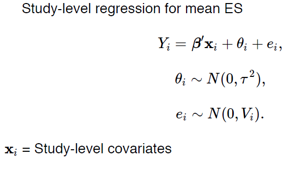

```{r setup, include=FALSE}
knitr::opts_chunk$set(echo = TRUE, comment="", message=FALSE, warning=FALSE, cache=TRUE, fig.width = 4, fig.height = 4)
options(width=80)
```


## Sub-group analysis
- Between-study heterogeneity is such an important issue in interpreting the results of our meta-analysis (make effect estimate less precise)
- We can explore sources of heterogeneity using influence analyses or detecting outliers.
- Another source of between-study heterogeneity could be that there are slight differences in the study design or intervention components between the studies. 
- For example, differences in inclusion or exclusion criteria, or in study design. Many other differences of this sort are possible, and it seems plausible that such study differences may also be associated with differences in the overall effect.
- In **subgroup analyses**, we therefore have a look at different subgroups within the studies of our meta-analysis and try to determine of the differ between these subgroups.


## Subgroup analysis

1. **Pooling the effect of each subgroup**. This point it rather straightforward, as the same criteria as the ones for a simple meta-analysis without subgroups apply here.

2. **Comparing the effects of the subgroups**. After we calculated the pooled effect for each subgroup, we can compare the size of the effects of each subgroup. However, to know if this difference is in fact singnificant and/or meaningful, we have to calculate the Standard Error of the differences between subgroup effect sizes, `SEdiff`, to calculate confidence intervals and conduct significance tests. There are two ways to calculate `SEdiff`, and both based on different assumptions. 

NOTE: The capabilites of subgroup analyses to detect meaningful differences between studies is often limited. Subgroup analyses also need sufficient power, so it makes no sense to compare two or more subgroups when your entire number of studies in the meta-analysis is smaller than k=10 (Higgins and Thompson 2004).


## Subgroup analysis

`dat.bcg`: Studies on the Effectiveness of the BCG Vaccine
                        Against Tuberculosis

```{r bcg}
library(meta)
data("dat.bcg", package="metafor")
head(dat.bcg)
table(dat.bcg$alloc)
```

## Subgroup analysis

```{r subgroup}
res.bcg <- metabin(tpos, tneg, cpos, cneg,
                   data = dat.bcg, byvar= alloc,
                   studlab = paste(author, year, sep=","))
summary(res.bcg)
```

## Subgroup analysis

```{r subgroup_plot}
forest(res.bcg)
```


## Subgroup analysis

```{r subgroup_plot2}
forest(res.bcg, layout = "JAMA")
```


## Meta regression: help to explain heterogeneity
- The inclusion of covariates in the analysis may help to control for heterogeneity
- **Meta-Regression** does not differ much from a **subgroup analysis**. 
- Actually, subgroup analyses with more than two groups are nothing more than a meta-regression with categorial covariates.
- Meta-regression does also allow us to use continuous data as covariates and check weather values of this variable are associated with effect size.
- Subgroup analyses make no sense when k<10. 
- For meta-regression, Borenstein and colleages (2011) recommend that each covariate should at least contain ten studies, although this should not be seen as clear rule. 

## Meta regression: help to explain heterogeneity



## Meta regression: help to explain heterogeneity

For meta-regression we compute 

$$R^2 = \frac{\tau^2_{REM} - \tau^2_{MEM}}{\tau^2_{REM}}$$

- $\tau^2_{REM}$ heterogeneity of Random Effects model
- $\tau^2_{MEM}$ heterogeneity of Meta-regression

## Meta regression: help to explain heterogeneity

`R^2 (amount of heterogeneity accounted for):` to see what the variable explains
`Test of Moderators`: Global test of the covariate
`Model results`: Sinificance of each category

\tiny

```{r metareg}
res.reg <- metareg(res.bcg, alloc)
res.reg
```
\normalsize

## Meta regression: help to explain heterogeneity

Let’s assume we want to check if the *publication year* is associated with effect size. 

\tiny

```{r metareg2}
res.reg2 <- metareg(res.bcg, ~ year)
summary(res.reg2)
```

\normalsize

## Meta regression: `bubble` plots

```{r bubble}
bubble(res.reg2, xlab = "Publication Year",
       col.line = "blue", studlab = TRUE)
```

# Exercises

## Exercises  (**Using R Markdown**)

`dat.hackshaw1998`: Results from 37 studies on the risk of lung cancer from environmental tobacco smoke (ETS) exposure. 

These are observational studies, so that, we only have beta effect (i.e. log odds ratio) encoded in the variable `yi` and sampling variance in `vi`.

1. Load the data into R by typing:

`data(dat.hackshaw1998, package="metafor")`

2. Run a fixed and random effect meta-analysis

3. Is there heterogeneity?

4. Run a sub-group analysis of studies performed at each country. Is there any difference? And by the type of design?

5. Is there any influence of the year of publication with regard the pooled effect?


## Publication Bias

**The File-Drawer Problem**

- It is possible that studies showing a significant intervention effect are more often published than studies with null results.
- When a meta-analysis is based only on studies reported in the
literature, null studies relegated to the file-drawer could bias the summary intervention effect in the direction of efficacy.

## Detecting publication bias: The Funnel plot

- A funnel plot is a scatter plot of the intervention effect estimates against a measure of study precision.
- Asymmetry (gaps) in the funnel may be indicative of publication
bias.
- Some authors argue that judging asymmetry is too subjective to
be useful.
- Spurious asymmetry can result from heterogeneity or when ESs
are correlated with precision.


## Funnel plots

```{r funnel}
data(cochrane, package = "rmeta")
res.coch <- metabin(ev.trt, n.trt, ev.ctrl, n.ctrl, 
               data=cochrane, studlab = name)
funnel(res.coch)
```

## Funnel plots

```{r funnel_lab}
funnel(res.coch, studlab = TRUE)
```

## Funnel plots

An even better way to inspect the funnel plot is through contour-enhanced funnel plots, which help to distinguish publication bias from other forms of asymmetry (Peters et al. 2008). Contour-enhanced funnels include colors signifying the significance level into which the effects size of each study falls. We can plot such funnels using this code:

```{r funnel_contour, eval=FALSE}
funnel(res.coch, xlab="Hedges' g", 
       contour = c(.95,.975,.99),
       col.contour=c("darkblue","blue","lightblue"))+
legend(1.4, 0, c("p < 0.05", "p<0.025", "< 0.01"),bty = "n",
       fill=c("darkblue","blue","lightblue"))
```


## Funnel plots


```{r funnel_contour_show, echo=FALSE}
funnel(res.coch, xlab="Hedges' g", 
       contour = c(.95,.975,.99),
       col.contour=c("darkblue","blue","lightblue"))
legend(1.4, 0, c("p < 0.05", "p<0.025", "< 0.01"),bty = "n",
       fill=c("darkblue","blue","lightblue"))
```


## Asymmetry: Egger's test

- Egger et al. (1997) proposed a test for asymmetry of the funnel plot. This is a test for the Y intercept = 0 from a linear regression of normalized effect estimate (estimate divided by its standard error) against precision (reciprocal of the standard error of the estimate). 

- Harbord (2005) developed a test that maintains the power of the Egger test whilst reducing the false positive rate, which is a problem with the Egger test when there are large treatment effects, few events per trial or all trials are of similar sizes. The original Egger test should be used instead of the Harbord method if there is a large imbalance between the sizes of treatment and control groups – the same is true for the Peto odds ratio, to which this test is mathematically related.


## Asymmetry: Egger's test

$H_0$: Simmetry

```{r egger}
metabias(res.coch, k.min=7) # default is 10
```


## Publication bias

- Judging asymmetry in the funnel plot can be difficult.
So you will usually want to consider some additional ways of
assessing the threat of publication bias.
- Sensitivity Analyses:
      - Trim-and-Fill
      - Fail Safe N


## Trim-and-fill method

- The trim-and-fill method estimates the number of missing NULL
studies from the meta-analysis.

- The function `trimfill` augments the observed data and returns the fitted object with the missing studies included.

- These points can be added to the funnel plot.


## Trim-and-fill method

The trim-and-fill procedure includes the following five steps (Schwarzer, Carpenter, and Rücker 2015):

- Estimating the number of studies in the outlying (right) part of the funnel plot.
-  Removing (trimming) these effect sizes and pooling the results with the remaining effect sizes.
- This pooled effect is then taken as the center of all effect sizes.
- For each trimmed/removed study, a additional study is imputed, mirroring the effect of the study on the left side of the funnel plot.
- Pooling the results with the imputed studies and the trimmed studies included.


## Trim-and-fill method

```{r trimfill}
res.trim <- trimfill(res.coch)
res.trim
```

## Trim-and-fill method

```{r trimfill_plot}
funnel(res.trim)
```


## Trim-and-fill method

```{r trimfill2}
funnel(res.trim, col=ifelse(res.trim$trimfill, 
                            "red", "blue"))
```

## Trim-and-fill method

The new resulting estimates are:

\tiny
```{r new_estimates}
summary(res.coch)
summary(res.trim)
``` 
\normalsize

## Trim-and-fill method

```{r new_estimates2, fig.weight=12}
par(mfrow=c(1,2))
funnel(res)
funnel(res.trim)
``` 

## Fail-Safe N

- Rosenthal method (sometimes called a *file drawer analysis*)
- Is the number of NULL studies that have to be added to reduce
the significance of the meta-analysis to (usually 0.05)
- It is availalbe in `metafor` package (function `fsn`)


## Fail-Safe N

Requires: `fsn(yi, vi)`

```{r}
library(metafor)
res.fsn <- fsn(res.coch$TE, res.coch$seTE^2)
res.fsn
```


# Exercises

## Exercises

`dat.hackshaw1998`: Results from 37 studies on the risk of lung cancer from environmental tobacco smoke (ETS) exposure. 

These are observational studies, so that, we only have beta effect (i.e. log odds ratio) encoded in the variable `yi` and sampling variance in `vi`.

1. Load the data into R by typing:

`data(dat.hackshaw1998, package="metafor")`

2. Assess whether there is publication bias in this meta-analysis.


## P-curve

- Recent research has shown that the assumptions of the small-effect study methods (traditional) may be inaccurate in many cases. The Duval & Tweedie trim-and-fill procedure in particular has been shown to be prone to providing inaccurate effect size estimates (Simonsohn, Nelson, and Simmons 2014).

- P-curve Analysis has been proposed as an alternative way to assess publication bias and estimate the true effect behind our collected data.

- P-Curve assumes that publication bias is not primarily generated because researchers do not publish non-significant results, but because the “play” around with their data (e.g., selectively removing outliers, choosing different outcomes, controlling for different variables) until a non-significant finding becomes significant. This (bad) practice is called p-hacking, and has been shown to be extremely frequent among researchers (Head et al. 2015).


## P-curve

It has been shown that P-Curve’s effect estimate are not robust when the heterogeneity of a meta-analyis is high ($I^2$ > 50%). Van Aert et al. (Aert, Wicherts, and Assen 2016) propose not to determine the 'true' effect using P-Curve when heterogeneity is high (defined as $I^2$ > 50%). 

http://p-curve.com/guide.pdf


## Session info

```{r}
sessionInfo()
```

