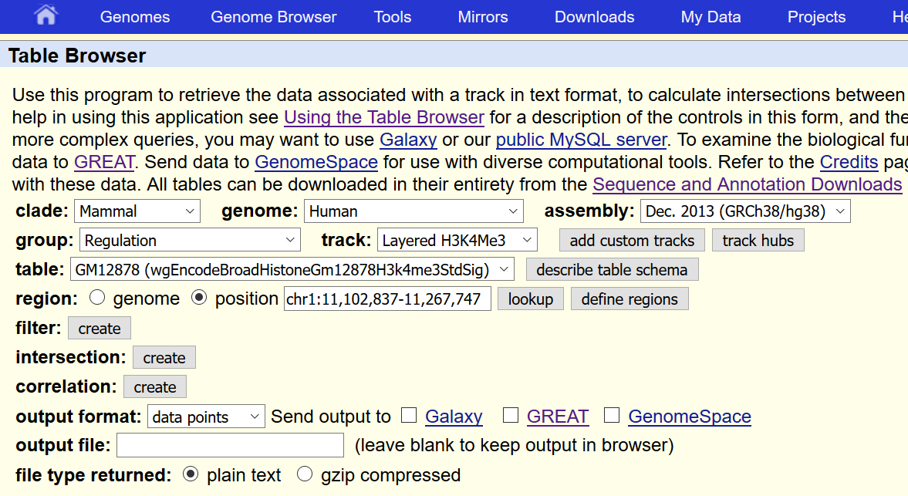
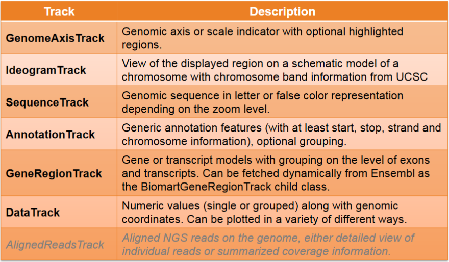
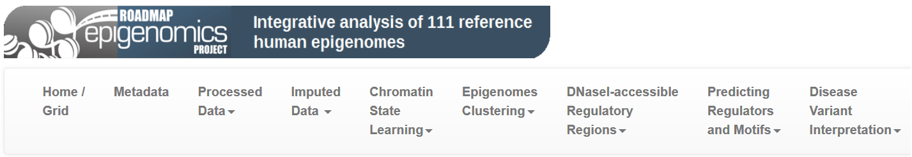
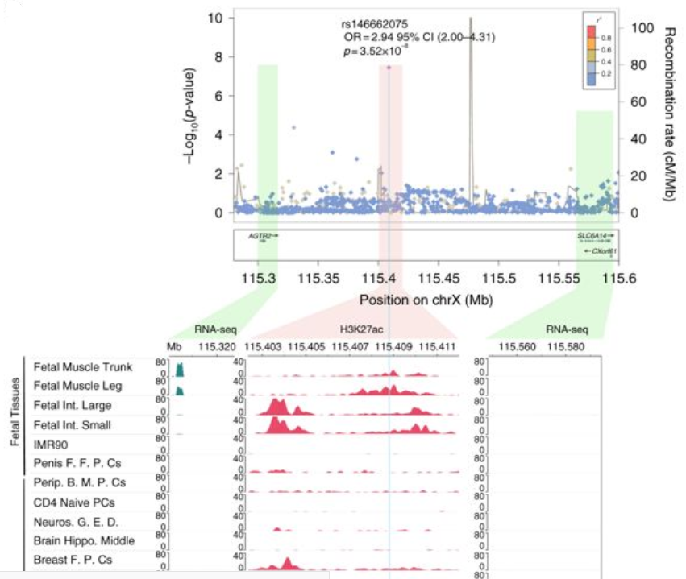

```{r style, echo = FALSE, results = 'asis'}
options(width=120)
knitr::opts_chunk$set(cache=TRUE, fig.align = TRUE, 
                      warning = FALSE,
                      message = FALSE, comment = "")
```

# Introduction

Omic data analyses normally assess whether a given feature (SNP, transcript, gene, CpG, CNV, ...) is associated with a given trait (disease, bmi, heigth, ..). They do not test a mechanistic hypothesis but discovers plausible biological associations that can guide into the mechanisms. The search for plausible mechanisms can be helped with the knowledge of whether a statistically significant feature is within a protein-coding gene, intergenic, or close to a regulatory element (e.g., a methylation mark) in tissues or cell types that are relevant to the trait. 

There are several databases that contain relevant biological information that can be used to biologically annotate SNPs, genes or CpGs among other features. For instance, the [GWAS Catalog](https://www.ebi.ac.uk/gwas/) contains information about SNPs associated with diseases at a genome-wide significant level, [ENCODE](https://www.encodeproject.org/) databases describe chromatin states, epigenetic marks and transcription factor bindings of genomic sites, and [GTEx](https://gtexportal.org/home/) data includes information about possible effects of SNPs on RNA expression. While there are a large number of data resources, we aim to illustrate how to use some that are commonly used.  

As in the whole course, in this lecture we do not aim to give a global overview either of existing packages to perform such annotation procedures since they are very well detailed in their related vignettes (anyway they will be cited through the document to let you know how to perform other analyses). Our goal is to provide the main details to reproduce real data analyses that appear in most of the papers which analyze omic data. 


# Types of annotations

## CpG islands

The CpG islands are the basis for all CpG annotations when performing epigenomic data analyses. CpG shores are defined as 2Kb upstream/downstream from the ends of the CpG islands, less the CpG islands. CpG shelves are defined as another 2Kb upstream/downstream of the farthest upstream/downstream limits of the CpG shores, less the CpG islands and CpG shores. The remaining genomic regions make up the inter-CGI annotation.


## Genic Annotations

Genic annotations include 1-5Kb upstream of the TSS, the promoter (< 1Kb upstream of the TSS - Transcriptional Start Site), 5’UTR, first exons, exons, introns, CDS, 3’UTR, and intergenic regions (the intergenic regions exclude the previous list of annotations). In Bioconductor, the genic annotations are determined by functions from `GenomicFeatures` and data from the `TxDb.*` and `org.*.eg.db` packages.


## Other types of annotations

- FANTOM5 permissive enhancers were determined from bi-directional CAGE transcription as in [Andersson et al. (2014)](https://www.nature.com/articles/nature12787)

- The long non-coding RNA (lncRNA) annotations are from [GENCODE](https://www.gencodegenes.org/) for hg19, hg38, and mm10. The lncRNA transcripts are used, and we eventually plan to include the lncRNA introns/exons at a later date. 

- Chromatin states determined by chromHMM ([Ernst and Kellis (2012)](https://www.nature.com/articles/nmeth.1906)) in hg19 are available for nine cell lines (Gm12878, H1hesc, Hepg2, Hmec, Hsmm, Huvec, K562, Nhek, and Nhlf) via the UCSC Genome Browser tracks.


# Case 1: Adding UCSC Annotation

- The UCSC data bases contain a multitude of genome annotation data for dozens of different organisms. 
- Some of those data are very simple annotations like CpG island locations or SNP locations. 
- Others are more complicated gene models, or even numeric annotations like conservation information. 
- In order to provide a unified interface to all this information, the Gviz package defines a meta-constructor function UcscTrack. 
- The idea here is that we can express all of the available UCSC data in one of the package’s track types.
- We can use the functionality provided in the `rtracklayer` package to connect to UCSC and to download the relevant information. 

To start we first need to know about the available data in the UCSC data base and about their structure. A good way to do this is to use the table browser on the [UCSC web site](http://genome.ucsc.edu/cgi-bin/hgTables?command=start). This shows the table structure for the first gene model track, the known UCSC genes, in the table browser:




This is one of the typical figures corresponding to the region chrX:65921878-65980988 wich is obtained from the UCSC web browser. This figure can be incorporated into the main paper or in the supplementary material to provide biological insights about main findings: 


It can be created in R by using the `GViz` package as illustrated [here](https://bioconductor.org/packages/release/bioc/vignettes/Gviz/inst/doc/Gviz.html#5_creating_tracks_from_ucsc_data). 

The different types of tracks available at `Gviz` can be found [here](https://bioconductor.org/packages/release/bioc/vignettes/Gviz/inst/doc/Gviz.html#4_track_classes). This vignette describe the different types of tracks that can be visualize and that are summarized here:




We can fetch data directly from UCSC. Let us start by retreiving the UCSC genes:

```{r ucsc_genes}
library(Gviz)
from <- 65921878
to <- 65980988
knownGenes <- UcscTrack(genome="mm9", chromosome="chrX",
                        track="knownGene", from=from, to=to,
                        trackType="GeneRegionTrack",
                        rstarts="exonStarts",
                        rends="exonEnds", gene="name",
                        symbol="name", transcript="name",
                        strand="strand", fill="#8282d2",
                        name="UCSC Genes")
```


Using the same function we can build the next two gene model tracks based on the *xenoRefGene* and *ensGene* data tables.

```{r other_refs}
library(Gviz)
refGenes <- UcscTrack(genome="mm9", chromosome="chrX",
                      track="xenoRefGene", from=from, to=to,
                      trackType="GeneRegionTrack",
                      rstarts="exonStarts", rends="exonEnds",
                      gene="name",
                      symbol="name2", transcript="name",
                      strand="strand", fill="#8282d2",
                      stacking="dense", name="Other RefSeq")

ensGenes <- UcscTrack(genome="mm9", chromosome="chrX",
                      track="ensGene", from=from, to=to,
                      trackType="GeneRegionTrack",
                      rstarts="exonStarts", rends="exonEnds",
                      gene="name",
                      symbol="name2", transcript="name",
                      strand="strand", fill="#960000",
                      name="Ensembl Genes")
```


Then, we need to create the CpG and SNP tracks. These are slightly different since a  `GeneRegionTrack` class would not be the most adequated. Instead, we can use `AnnotationTrack`  objects as containers:

```{r annot_CpG_SNP }
cpgIslands <- UcscTrack(genome="mm9", chromosome="chrX",
                        track="cpgIslandExt", from=from,
                        to=to, trackType="AnnotationTrack",
                        start="chromStart", end="chromEnd",
                        id="name", shape="box",
                        fill="#006400", name="CpG Islands")

snpLocations <-  UcscTrack(genome="mm9", chromosome="chrX",
                           track="snp128", from=from, to=to,
                           trackType="AnnotationTrack",
                           start="chromStart", end="chromEnd",
                           id="name",  feature="func",
                           strand="strand", shape="box",
                           stacking="dense", fill="black",
                           name="SNPs")
```


Then, most of UCSC’s data can be encapsulated as `DataTrack` class. For instance, the conservation information and GC-content can be annotated using:

```{r annot_conservation_CpG}
conservation <- UcscTrack(genome="mm9", chromosome="chrX",
                          track="Conservation",
                          table="phyloP30wayPlacental",
                          from=from, to=to,
                          trackType="DataTrack",
                          start="start", end="end",
                          data="score",
                          type="hist", window="auto",
                          col.histogram="darkblue",
                          fill.histogram="darkblue",
                          ylim=c(-3.7, 4),
                          name="Conservation")

gcContent <- UcscTrack(genome="mm9", chromosome="chrX",
                       track="GC Percent", table="gc5Base",
                       from=from, to=to,
                       trackType="DataTrack", start="start",
                       end="end", data="score",
                       type="hist", window=-1,
                       windowSize=1500,
                       fill.histogram="black",
                       col.histogram="black",
                       ylim=c(30, 70), name="GC Percent")
```

To understand which tables are available we can query the `rtracklayer` package to identify track and table names as following

```{r tables_UCSC}
library(rtracklayer) 
session <- browserSession() 
genome(session) <- "hg19" 
trackNames(session)[1:20]
```

Once all the annotation data has been retreived, we start by creating a track wich encodes the genome axis and the ideogram of the X chromosome:

```{r genome_ideogram_chrX}
axTrack <- GenomeAxisTrack()
idxTrack <- IdeogramTrack(genome="mm9", chromosome="chrX")
```

Then, we are ready to create the figure which includes all the required tracks:

```{r plot_UCSC}
plotTracks(list(idxTrack, axTrack, knownGenes, refGenes,
                ensGenes, cpgIslands,
                gcContent, conservation, snpLocations),
           from=from, to=to, showTitle=FALSE)
```

# Case 2: Adding GWAS catalog hits

- GWAS catalog contains SNPs which has been associated with human complex diseases and traits. 

- Data can be directly donwloaded from [here](https://www.ebi.ac.uk/gwas/) and incorporated into `GViz` plots by using `DataTrack` function. 

- It can also be retrieved using `UcscTrack()` function. 

- The package `gwascat` from Bioconductor is the better option. There is a function to create the most recent version of GWAScatalog data (`makeCurrentGwascat`). There are two available versions: `ebicat38` (hg18) and `ebicat37` (hg19). 

- One of the advantadges of using `gwcex2gviz()` is that it also retrieves gene anotations

```{r gwascat}
library(gwascat)
data(ebicat37) # gwas catalog - h19 coordinates
roi <- GRanges(seqnames="chr8", 
               IRanges(start = 48e6, end = 56e6))

gwas <- gwcex2gviz(basegr = ebicat37, 
                   contextGR=roi, plot.it=FALSE)
gwasTrack <- gwas[[1]]
gwasTrack
genesTrack <- gwas[[3]]
genesTrack
```

Then, the plot can be created by:

```{r plot_example_GWAS}
gtrack <- GenomeAxisTrack()
itrack <- IdeogramTrack(genome = "hg19", 
                        chromosome = "chr8")

plotTracks(list(itrack, gtrack, genesTrack,
                gwasTrack), 
           from = start(roi),
           to = end(roi))
```


# Case 2: Genomic Regions and Roadmap Epigenomics

All Roadmap Epigenomics files are hosted [here](https://egg2.wustl.edu/roadmap/data/byFileType/). There are several datasets that can be used for interpreting our results:




For instance, several studies are interested in annotating cromatine marks:

- H3K4me3: commonly associated with the activation of transcription of nearby genes.
- H3K4me1: considered active or primed enhancers.
- H3K36me3: play roles in many important biological processes such as DNA replication, transcription, recombination and repair of DNA damage.
- H3K27me3: is used in epigenetics to look for inactive genes.
- H3K9me3: has a pivotal role in embryonic stem cells at the onset of organogenesis during lineage commitment, and also a role in lineage fidelity maintenance.
- H3K27ac: is associated with the higher activation of transcription and therefore defined as an active enhancer mark


This is a real example:




This code illustrate how to obtain, for instance, annotation Layered H3K27Ac

```{r load_h3k4me3, eval=FALSE}
H3K4me3 <- UcscTrack(genome = "hg19", 
                     chromosome = seqnames(region),
                     track = "Layered H3K27Ac",
                     table = "wgEncodeBroadHistoneHsmmH3k4me3StdSig",
                     from=1, to=10e6,
                     trackType = "DataTrack", 
                     start = "start",
                     end = "end", data="score", type="hist",
                     window=-1, windowSize=1500,
                     fill.histogram="orange",
                     col.histogram="orange", name="H3K27Ac")
```

However, this can have problems for large regions. `AnnotationHub` package can help to manage annotations from different projects, in particular from RoadMap Epigenomics. 

```{r roadmap}
library(AnnotationHub)
ah <- AnnotationHub()

H3K27Ac <- query(ah , c("EpigenomeRoadMap", "H3K27Ac"))
H3K27Ac
```

Let us imagine we performed a transcriptomic data analysis on asthma. Then, one may be interested in creating the `DataTrack`s for data obtained in lung tissue and compare it, for instance,  with other tissues such as stomach and bladder. The idea is to see  whether our hits map over that regions

```{r look_ids_roadmap}
H3K27Ac[grep("Lung", H3K27Ac$title),]
H3K27Ac[grep("Stomach", H3K27Ac$title),]
H3K27Ac[grep("Bladder", H3K27Ac$title),]
```

Then, the selected databases are:

```{r get_ke}
ids <- c("AH44566", "AH44076", "AH44180")
peaks <- list()
for (i in ids){
 peaks[[i]] <- H3K27Ac[[i]]
}

peaksTrack <- lapply(peaks, DataTrack, data="score",
                     type="mountain", ylim=c(0,100),
                     name="H3K27Ac")
```

Let us create a plot for a real data analysis. 
[Pickrell et al. (2018)](https://www.ncbi.nlm.nih.gov/pmc/articles/PMC5207801/) performed an analysis to discover pleiotropic regions along the genome. Let us investigate whether these regions maps over regions which activatie transcription of nearby genes (H3K4me3) in the selected tissue. Let us start by creating a `GRange` of pleiotropic regions that can be dowloaded from the supplementary material of the paper (also available in the `data` folder of the GitHub repository):

```{r load_pleio}
library(GenomicRanges)
rois <- read.delim("data/ng.3570-S2.txt", comment.char = "#",
                  as.is=TRUE)
colnames(rois)
regionsGR <- makeGRangesFromDataFrame(rois, seqnames="chr", 
                                      start.field = "st",
                                      end.field = "sp")
regionsGR
```


Let us imagine we want to create a plot including all the pleiotropic regions in chr1:1.0Mb-100.0Mb

```{r roi_pleio_chr1}
rr <- GRanges(seqnames = "chr1", 
              IRanges(start = 1e6, end=100e6))
rr2 <- subsetByOverlaps(regionsGR, rr)
roi <- AnnotationTrack(rr2, name="ROI")
```

The plot is created by:

```{r plot_pleio}
gtrack <- GenomeAxisTrack()
itrack <- IdeogramTrack(genome = "hg19", 
                        cromosome=seqnames(rr2))


plotTracks(c(itrack, gtrack, roi, peaksTrack), 
           from = min(start(rr2)),
           to = max(end(rr2)))
```

Note the use of `chromosome = seqnames(rr2)`, `min(start(rr2))` and `max(end(rr2))`

We can add gene symbols in another track to make the plot more informative. 

```{r add_genes_pleio}
library(GenomicFeatures)
library(TxDb.Hsapiens.UCSC.hg19.knownGene)
library(org.Hs.eg.db)
allg <- genes(TxDb.Hsapiens.UCSC.hg19.knownGene)
allg.range <- subsetByOverlaps(allg, rr2)
allg.range$symbol <- mapIds(Homo.sapiens::Homo.sapiens, 
                                keys=allg.range$gene_id,
                                keytype="ENTREZID",
                                column="SYMBOL")

genes <- GeneRegionTrack(allg.range, genome = "hg19",
                         chromosome = seqnames(rr2),
                         showId=TRUE,
                         geneSymbol=TRUE,
                         start = min(start(rr2)), 
                         end = max(end(rr2)),
                         name = "Genes")
```


```{r plot_pleio_genes, fig.height=14, fig.width=8}
gtrack <- GenomeAxisTrack()
itrack <- IdeogramTrack(genome = "hg19", 
                        cromosome=seqnames(rr2))

plotTracks(c(itrack, gtrack, roi, genes, peaksTrack), 
           from = min(start(rr2)),
           to = max(end(rr2)))
```


# Case 3: Circos plot of gene expression or methylation data analysis


## Differential expression analysis

- `limma` is the reference package to analyze both transcriptomic and epigenomic data
- Linear models are fitted to each feature
- Variance is estimated by modeling mean-variance relationship
- RNA-seq are count data, so that, negative binomial regression is required (`edgeR`, `DESeq2`). However, `voom` transformation can be used to get normal data.


## Differential expression analysis

Let us determine the genes that are differentially expressed (DE) between healthy individuals and smokers with severe asthma.

```{r de}
library(limma)
load("data/GSE69683.Rdata")
design <- model.matrix( ~ characteristics_ch1,
                        data=gse69683.expr)
colnames(design)
fit <- lmFit(gse69683.expr, design)
fit <- eBayes(fit)
de <- topTable(fit, coef=4)
de[1:5 , c(17:22)]
```

Inflation (produced by batch effects or uncontrolled variables) is normally tested by using QQ-plot

 
```{r qqplot_asthma}
qqt(fit$t, df=fit$df.prior+fit$df.residual,
    pch=16,cex=0.2)
abline(0,1, col="red", lwd=2)
```


Surrogate variable analysis (SVA) can be used to correct for uncontrolled variables. The [sva package](http://bioconductor.org/packages/release/bioc/vignettes/sva/inst/doc/sva.pdf) can be used to this end. This procedure is implemened in the [MEAL package](https://bioconductor.org/packages/release/bioc/html/MEAL.html) that requires less R code. Note that `fNames` argument allows to add annotation to the results by passing any of the existing variables in the feature data (`fData`) of the `ExpressionSet` object
 

```{r de_meal}
library(MEAL)
load("data/GSE69683.Rdata")

# shows available annotated variabels
names(fData(gse69683.expr))

# DE analysis
ans <- runPipeline(gse69683.expr,
                   variable = "characteristics_ch1",
                   sva = TRUE)
ans

fit <- getProbeResults(ans, coef=4, 
                       fNames=c("ID", "Gene Symbol"))
head(fit)
```


The QQ-plot is then produced by

```{r qqplot_meal}
plot(ans, type="QQ")
```

We normally represent those genes that pass 5% FDR threshold. In this example we will increase such value and will find those DE genes at 10% level:


```{r de_10fdr}
de <- fit[fit$adj.P.Val<0.1,]
dim(de)
de
```

Let us create a variable indicating whether the gene is down- (red) or up-regulated (blue)

```{r down_up}
de$sign <- ifelse(de$logFC < 0, "red", "blue")
table(de$sign)
```

A circos plot maps those DE genes along the genome. Then, we first need to get chromosome and position of genes. This task can be done using several Bioconductor packages `AnnotationHub`, `OrgDb` objects, `TxDb` objects, `biomaRt`. See [here](https://www.bioconductor.org/packages/devel/workflows/vignettes/annotation/inst/doc/Annotation_Resources.html). some examples

```{r circos}
library(org.Hs.eg.db)
# see columns(org.Hs.eg.db)
cols <- c("SYMBOL", "CHR", "CHRLOC", "CHRLOCEND"  )
annot <- select(org.Hs.eg.db, keys=de$"Gene Symbol",
                columns=cols, 
                keytype="SYMBOL")
annot <- subset(annot, !duplicated(SYMBOL) & !is.na(CHR))
bd <- merge(annot, de, by.x="SYMBOL", by.y="Gene Symbol")
dim(bd)
head(bd)
```

Let us start by drawin the chromosomes with their cytobands 

```{r omic1, fig.height=5, fig.width=5}
library(OmicCircos)

plot(c(1,800), c(1,800), 
     type="n", axes=FALSE, xlab="", ylab="")
circos(R=300, type="chr", cir="hg19", col=TRUE, 
       print.chr.lab=TRUE, W=10, cex=2)
```

Then let us add the results of our transcriptomic data analysis and the gene symbols of the DE genes

```{r omic2, fig.height=5, fig.width=5}
plot(c(1,800), c(1,800), 
     type="n", axes=FALSE, xlab="", ylab="")
circos(R=300, type="chr", cir="hg19", col=TRUE, 
       print.chr.lab=TRUE, W=10, cex=2)

circos(R=250, cir="hg19", W=40,
      mapping = bd[,c("CHR", "CHRLOCEND", "logFC")], 
      type="b3", lwd=3, B=TRUE, cutoff = 0, 
      col=bd$sign)

circos(R=300, cir="hg19", W=40, 
       mapping=bd[,c("CHR", "CHRLOCEND", "SYMBOL")], 
       type="label", side="out", cex=0.6)
```


We can improve the plot by having more tracks. Let us assume we want to represent the DE genes for smokers and non-smoker asthmatics 

```{r table_grouping_var}
table(gse69683.expr$`characteristics_ch1`)
```


The DE genes for each group is obtained by

```{r de_meal_2_groups}
ff <- list()
for (i in 1:2)
  ff[[i]] <- getProbeResults(ans, coef=i+2, 
                       fNames=c("ID", "Gene Symbol"))
de <- lapply(ff, function(x) x[x$adj.P.Val<0.1,])
de <- lapply(de, function(x) cbind(x, 
                                   sign=ifelse(x$logFC < 0,
                                               "red",
                                                "blue")))
de <- lapply(de, function(x) merge(annot, x, 
                                   by.x="SYMBOL", 
                                   by.y="Gene Symbol"))
head(de[[1]])
```


Then, the circos plot is created by:

```{r circos_three, fig.height=5, fig.width=5}

plot(c(1,800), c(1,800), type="n", 
     axes=FALSE, xlab="", ylab="")

circos(R=300, type="chr", cir="hg19", col=TRUE, 
       print.chr.lab=TRUE, W=10, cex=2)

mycols <- c("green", "darkblue")
for (i in 1:2) {
  circos(R=300, cir="hg19", W=40, 
       mapping=de[[i]][,c("CHR", "CHRLOCEND", "SYMBOL")], 
       type="label", side="out", cex=0.6)
  
  circos(R=250 - 40*(i-1), cir="hg19", W=40,
       mapping = de[[i]][,c("CHR", "CHRLOCEND", "logFC")], 
       type="b3", lwd=3, B=TRUE, cutoff = 0, 
       col=de[[i]]$sign)
}
```

Other features for circos plot can be found [here](http://bioconductor.org/packages/release/bioc/vignettes/OmicCircos/inst/doc/OmicCircos_vignette.pdf).


--------------------------------------------------

**EXERCISE**: The file `data_exercises/GSE57475.Rdata` contains data corresponing to the GEO accesion number GSE57475. This dataset was used to test whether peripheral blood gene expression profiles could be used as a molecular diagnostic tool for distinguishing children with Autistic Spectrum Disorder (ASD) from controls by performing peripheral blood gene expression profiling on 170 patients with ASD and 115 controls collected from Boston area hospitals.

1. Determine those genes that are differentially expressed between CONTROLs and the three types of ASD analyzed (AUTISM, PDD-NOS and ASPERGER'S DISORDER) (variable `group`).

2. Represent the results in a circos plot indicating with different colors those genes which are down- and up-regulated of each disorder

3. Select the gene most associated to AUTISM and determine its chromosome and position. Create a plot with the following tracks in window of $\pm$ 10Mb:

    - Exons from UCSC
    - CpG islands distribution 
    - Cromatine marks of H3K27Ac of different tissues (Cingulate_Gyrus, Hippocampus and Mid_Frontal_Lobe that can be important for ASD and bladder as a control)
    - Hits from GWAS catalog
  
NOTE: You can use this code to annotate gene symbol

```
target <- "BRCA"
library(org.Hs.eg.db)
cols <- c("SYMBOL", "CHR", "CHRLOC", "CHRLOCEND"  )
annot <- select(org.Hs.eg.db, keys=target,
                columns=cols, 
                keytype="SYMBOL")
annot
```


--------------------------------------------------

## Session info

```{r}
sessionInfo()
```

